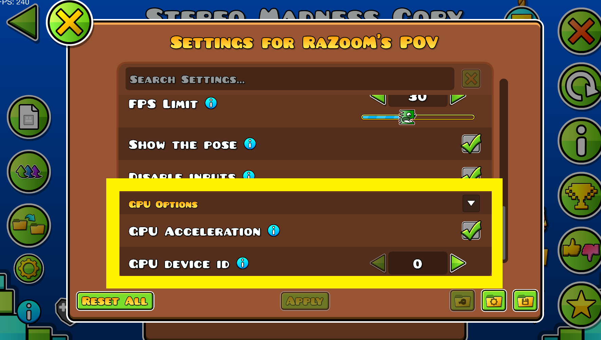
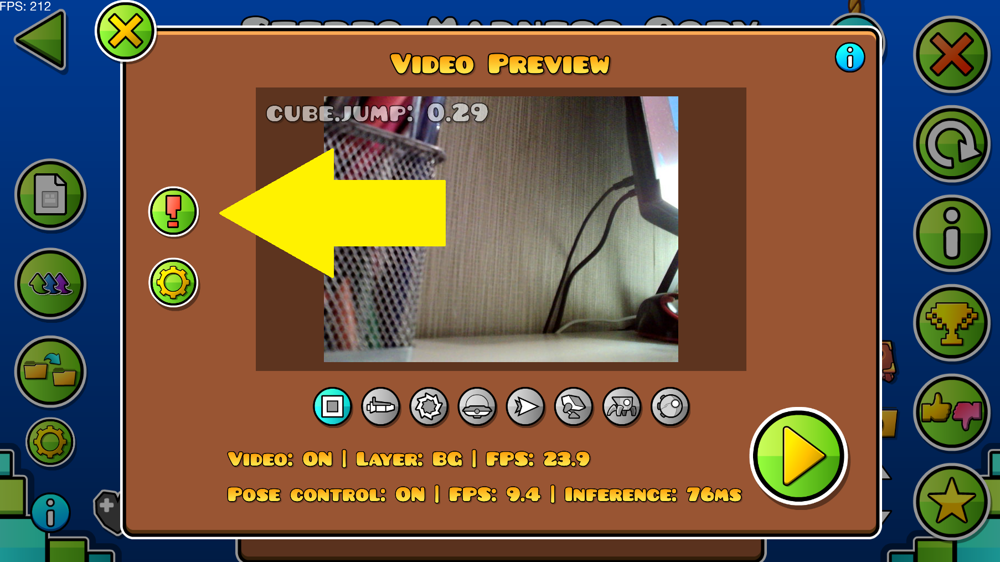

# Troubleshooting DirectML errors

As you may already know, with this mod you can use GPU to accelerate pose estimation.
This acceleration is enabled by default:



Under the hood this mod uses **DirectML** to access GPU and accelerate pose estimation. **DirectML** is a low-level machine learning API by Windows. It's pre-installed on almost all Windows 10 and 11 PC-s.

However on some systems errors can occur. In case of errors mod will still work, but on CPU and with worse performance.

Press the `"!"` button to see the errors (if there are no `"!"` button, there are no errors):




Read the text of the error. There are 2 types of errors covered in this guide:

- [No adapter with the specified ordinal](#No-adapter-with-the-specified-ordinal).
- [No such interface supported](#no-such-interface-supported).


## No adapter with the specified ordinal

Error text looks like this:

```
Not able to use DirectML (Code: 6). 
D:\a_work\2\s\onnxruntime\core\providers\dml\dml_provider_factory.cc(125)\onnxruntime_pybind11_state.pyd!00007FF98E402FE3: (caller: 00007FF98E402D81) Exception(7) tid(603c) 887A0002 
The object was not found. If calling IDXGIFactory::EnumAdaptes, there is no adapter with the specified ordinal.
```

This error means that in the mod settings you've specified the non-existent `GPU device id`. Go to the mod settings and change it or reset to default.


## No such interface supported

Error text looks like this:

```
Not able to use DirectML (Code: 6). 
D:\3\s\onnxruntime\core\providers\dml\DmlExecutionProvider\src\FusedGraphKernel.cpp(64)\onnxruntime.dll!00007FF806AF4FBD: (caller: 00007FF806AF4578) Exception(1) tid(9770) 80004002 
No such interface supported
```

This error means that the mod is not able use the DirectML library. Which may happen if the DirectML version installed in your system is old and not supported.

I personally got this error when I tested the mod on Windows 10. And was able to fix this by manually downloading the latest version of DirectML. Here is how:

*(I can't guarantee that it will work, but it did work for me, so it's worth a try)*

- Go to this website: https://www.nuget.org/packages/Microsoft.AI.DirectML/1.15.4
- Click on the `Download package` link on the right side of the screen. `microsoft.ai.directml.1.15.4.nupkg` file will be downloaded
- Change file extension to `.zip` and then unzip the archive
- In unzipped folder go to `/bin/x64-win/` and copy the `DirectML.dll` file
- Paste `DirectML.dll` into the Geometry Dash root folder: `C:\Program Files (x86)\Steam\steamapps\common\Geometry Dash`
- Restart Geometry Dash and error should not appear


