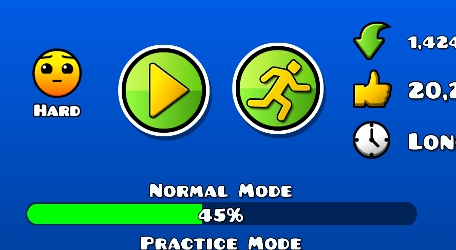
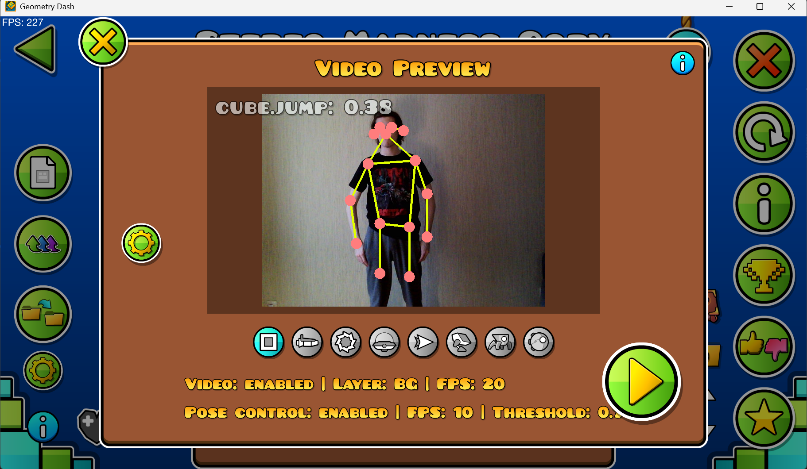
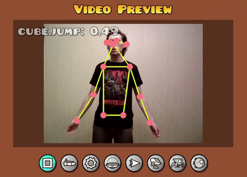

# What the heck!?

Video of me beating a level: [link](https://drive.google.com/file/d/1XcRoJc7gn7eMomx84zoVwuAHGEfKb2Xb/view?usp=sharing)

# Tutorial

- Русская версия этого туториала: [тут](general_ru.md)

In this tutorial, I will teach you how to use play GD with this mod. It may not be easy for you and may not work out at first, so **be prepared to put in some effort**.

## Initial setup

Assume you've installed the mod and launched the game (When you restart the game after installing the mod, you may get an error of missing dependency, which is a geode bug. If so, restart the game for the second time).

Now open a page with any non-platformer level. You'll see the a new button next to the 'play' button. Click it!

You may also need to agree to use your camera. After that you'll see a popup like that:

If you see an error instead of video, click on the '!' button and read what it text says.

But assume everything is OK and you can see the video of yourself and the yellow lines that match your pose.

> [!IMPORTANT]
> **It's essential that mod detects both of your arms**
> 
> **Otherwise, try to make a video more contrasting: use better lighting or wear more contrasting clothes**

## Playing with the mod

As you may have already understood, with this mod you can control the game with your pose and movements. Basically, this means that you have to get into the right pose and make the right movement to make a click in the game.

That actions are different for the different game modes. They are all listed in the table in the next section (with the gifs and descriptions)

## Training

As I said, it will take some effort to be able to play with this mod (and even more to master it). You will need to memorize the movements for each game mode and repeat them clearly while playing the game.

Fortunately, the mod will help you learn the right moves.

Select the game mode that you want to learn using the buttons under the video. Repeat the movement from the table below. When you do it, mod compares your pose with some pre-defined ones and computes the *similarity coefficients* (you can see them in the top left corner of the video). If the `coefficient > 0.7`, then the pose is accepted and the click is made (you will see the green 'click' label).

## Table of poses

This table shows poses that are close to ideal. (which can be seen by the *similarity coefficients*, which are close to 1)

> [!NOTE]
> There are gifs in this table. They may take couple of seconds to load.

<table>
  <tr>
    <td colspan="2">
      <h3>Cube</h3>
    </td>
  </tr>
  <td>
    
  </td>
  <td>
    Raise your forearms to jump
  </td>

  <tr>
    <td colspan="2">
      <h3>Ship</h3>
    </td>
  </tr>
  <td>
    
  </td>
  <td>
    Raise your arms up to fly up, lower - to fly down
  </td>

  <tr>
    <td colspan="2">
      <h3>Ball</h3>
    </td>
  </tr>
  <td>
    
  </td>
  <td>
    This one is just like the cube
  </td>

  <tr>
    <td colspan="2">
      <h3>Ufo</h3>
    </td>
  </tr>
  <td>
    
  </td>
  <td>
    Imagine that you have wings and you flap them. <i>(Fun fact: Ufo is called 'bird' in the game files and code)</i>
  </td>

  <tr>
    <td colspan="2">
      <h3>Wave</h3>
    </td>
  </tr>
  <td>
    
  </td>
  <td>
    Pretty straightforward
  </td>

  <tr>
    <td colspan="2">
      <h3>Robot</h3>
    </td>
  </tr>
  <td>
    
  </td>
  <td>
    This one is just like the cube and ball
  </td>

  <tr>
    <td colspan="2">
      <h3>Spider</h3>
    </td>
  </tr>
  <td>
    
  </td>
  <td>
    The arm movements are similar to the spider trajectory
  </td>

  <tr>
    <td colspan="2">
      <h3>Swing</h3>
    </td>
  </tr>
  <td>
    
  </td>
  <td>
    This one is just like the cube and ball and robot
  </td>

  
</table>

## Finale

After all the preparing and trainings, you will be able to play levels with this mod like in the video in the beginning of this tutorial!

## From developer

I will make an updates for the mod and add more features such us

- Support for GPU to speed up pose estimation
- Ability to add your own poses and edit existing ones
- Green screen support
- Your suggestions from my [Discord](https://discord.gg/wcWvtKHP8n)

Thanks for using my mods ❤️!
